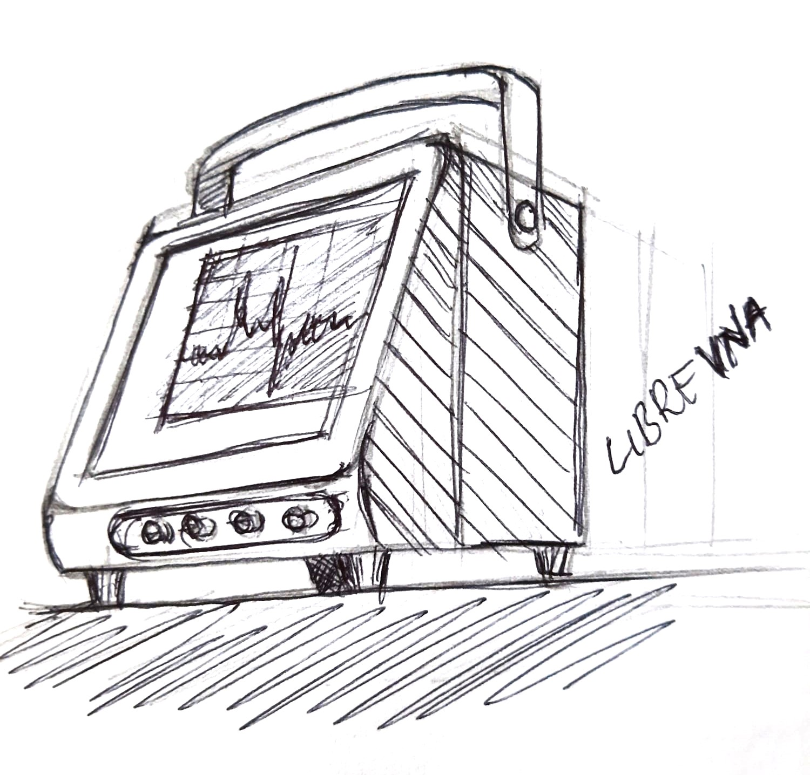
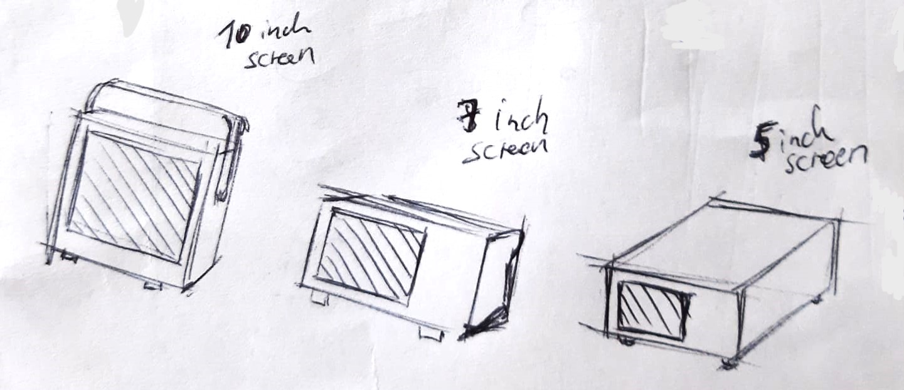
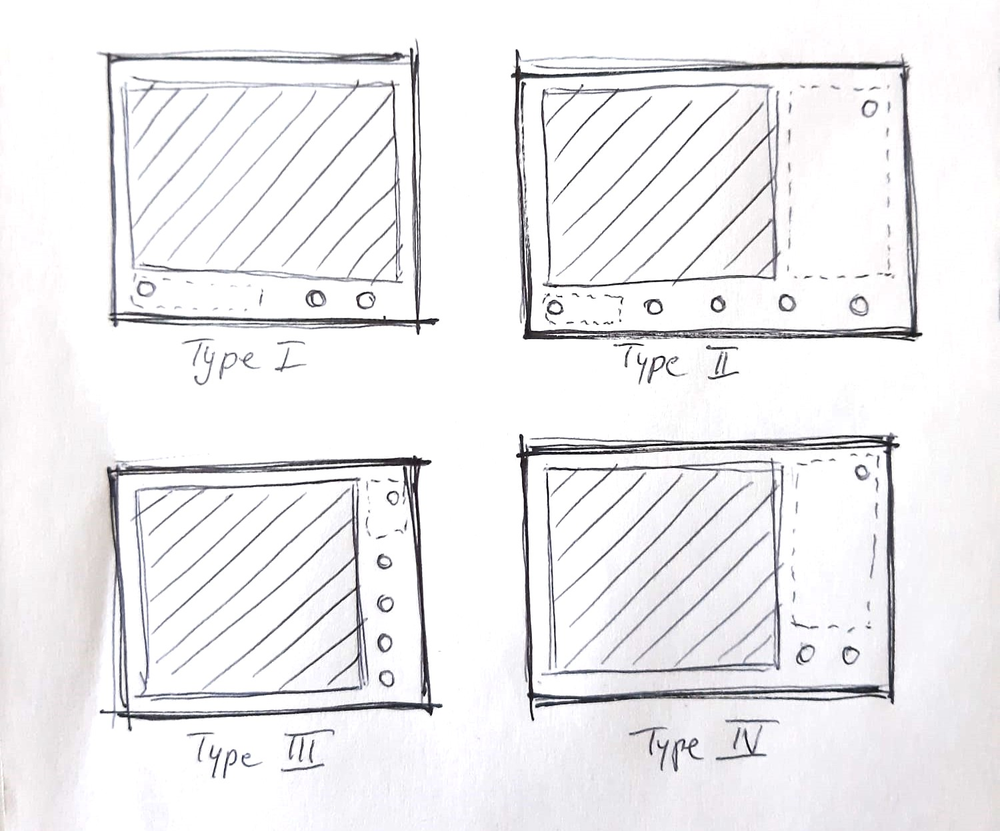

# Open-Source Measurement Equipment

Generic measurement equipment framework (enclosure, PSU, display, ...) to be used with:
- Digital Oscilloscopes
- Waveform Generators
- Spectrum Analyzers
- RF Generators
- Vector Network Analyzers
- RF Switch Systems
- Digital Multimeters
- DC Electronic Loads
- Power Supplies

*Figure 1: Enclosure for the LibreVNA PCB*

## Formfactors
- 10 inch touchscreen
- 7 inch touchscreen
- 5 inch touchscreen

*Figure 2: Different measurement equipment formfactors with screen sizes of 10, 7 and 5 inches*

## Front panel design types
- Screen
- Analog controls
- Connectors

*Figure 3: Four Different front panel design types based on the layout of the screen, analog controls and connectors.*

## Bill of materials (10 inch touchscreen, type I, mechanical)
*Table 1: Bill of materials for a device with a 10 inch touchscreen and type I front panel layout including the price and supplier for the components.*
| Item no. | Description                                                | Count | Price | Supplier |
|----------|------------------------------------------------------------|-------|-------|----------|
| 1  | Measurement equipment PCB                                  |   1   |       |          |
| 2  | Steel enclosure frame                                      |   1   |       |          |
| 3  | Raspberry PI 5                                             |   1   |       |          |
| 4  | SD card                                                    |   1   |       |          |
| 5  | PSU for Raspberry PI 5                                     |   1   |       |          |
| 6  | USB-C cable                                                |   1   |       |          |
| 7  | Fan for steel enclosure                                    |   1   |       |          |
| 8  | PSU for fan                                                |   1   |       |          |
| 9  | Plastic or rubber feet + screws for steel enclosure        |   4   |       |          |
| 10 | 3D-printed plastic front panel                             |   1   |       |          |
| 11 | Brand and model sticker                                    |   1   |       |          |
| 12 | Brass threaded inserts (?x)                                |       |       |          |
| 13 | 10 inch touch screen with HDMI                             |   1   |       |          |
| 14 | Touch screen mounting screws                               |   4   |       |          |
| 15 | Touch screen PSU                                           |   1   |       |          |
| 16 | Micro-HDMI to HDMI cable (correct?)                        |   1   |       |          |
| 17 | On button                                                  |   1   |       |          |
| 18 | On/off switch                                              |   1   |       |          |
| 19 | Mains connector                                            |   1   |       |          |
| 20 | Some way to connect all devices to mains (help?)           |   1   |       |          |
| 21 | Handle                                                     |   1   |       |          |
| 22 | Handle mechanism (?) → patent search for free alternatives |   1   |       |          |

## Design reference
For reference on enclosure design.
- Rigol DHO800: https://www.youtube.com/watch?v=KQF4UzLPpr0
- Rohde & Schwarz HMO1202: https://www.youtube.com/watch?v=q_FBwu2K7j0
- Tektronix 2 Series Oscilloscope: https://www.youtube.com/watch?v=R2fw2g6WFbg
- Rohde & Schwarz MXO4: https://www.youtube.com/watch?v=BTuXbY_nBOM
- Tektronix MDO3000: https://www.youtube.com/watch?v=VFX47ZGOn_o
- Siglent SVA1015X VNA: https://www.youtube.com/watch?v=HxBcQDooAYs
