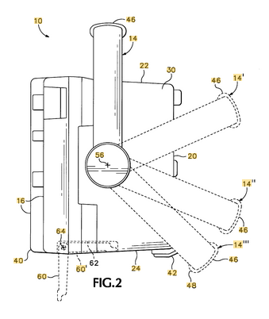
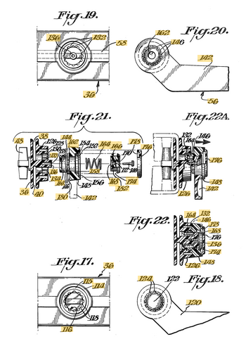
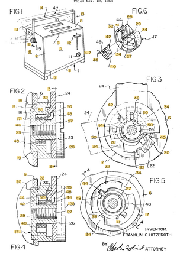
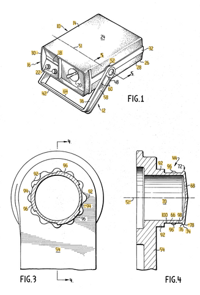
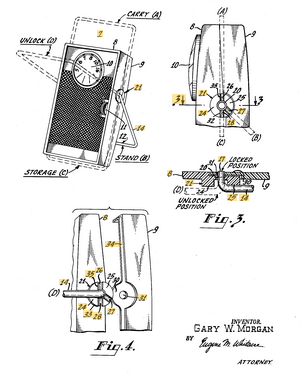
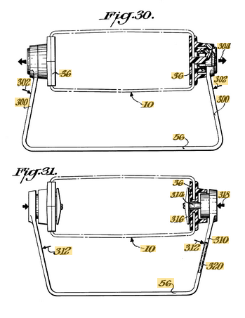
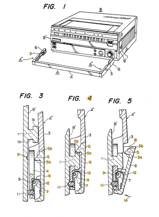

> [!NOTE]
> **Add components from suppliers to BOM**  
> Link to the specific components on de.farnell.com and de.rs-online.com/web in the BOM and upload the CAD file as *.STEP

# Open-Source Measurement Equipment
Open-source framework for designing and manufacturing measurement equipment devices:
- Digital Oscilloscopes
- Waveform Generators
- Spectrum Analyzers
- RF Generators
- Vector Network Analyzers
- RF Switch Systems
- Digital Multimeters
- DC Electronic Loads
- Power Supplies

*Figure 1: Enclosure for the LibreVNA PCB*

## Formfactors
- 10 inch touchscreen
- 7 inch touchscreen
- 5 inch touchscreen

*Figure 2: Different measurement equipment formfactors with screen sizes of 10, 7 and 5 inches*

## Front panel design types
- Screen
- Analog controls
- Connectors

*Figure 3: Four Different front panel design types based on the layout of the screen, analog controls and connectors.*

## Suppliers
- RS Components GmbH: [de.rs-online.com/web](https://de.rs-online.com/web)
- Farnell GmbH: [de.farnell.com](https://de.farnell.com)

## Bill of materials (10 inch touchscreen, type I, mechanical)
*Table 1: Bill of materials for a device with a 10 inch touchscreen and type I front panel layout including the price and supplier for the components.*
| Item no. | Description                                                | Count | Price (excl. tax) | Supplier |
|----------|------------------------------------------------------------|-------|-------|----------|
| 1  | Measurement equipment PCB                                  |   1   |   ?   |    PCB manufacturing service      |
| 2  | Steel enclosure frame                                      |   1   |   ?   |    sheel metal manufacturing service      |
| 3  | Raspberry Pi5 2GB                                             |   1   |   43,34 €     |    (https://de.farnell.com/raspberry-pi/raspberry-pi-5-2g/rpi-5-board-2-4ghz-2gb-arm-cortex/dp/4531087?MER=BR-MER-CA-RECO-STM71778)      |
| 4  | SD card                                                    |   1   |  10,76 €    |    (https://de.farnell.com/raspberry-pi/pi-os-32gb/microsdhc-karte-32-gb-rpi-4-5/dp/4550988)      |
| 5  | PSU for Raspberry PI 5                                     |   1   |  6,62 €   |    (https://de.farnell.com/edatec/ed-psu1201-eu/ac-dc-adapter-rpi-board-eu-12vdc/dp/4627205)    |
| 5  | Nylon-Standoffs for Raspberry PI 5                                     |   1   |  0,51 €   |    (https://de.farnell.com/multicomp/rpi-nylon-standoff-kit/abstandhalter-m-gewinde-raspberry/dp/2543622)    |
| 6  | Fan for steel enclosure                                    |   1   |   6,38 €    |     (https://de.farnell.com/sunon/mf60101v3-1000u-a99/dc-fan-vapo-60mm-3000rpm-12vdc/dp/4382085?MER=BR-MER-PDP-RECO-STM72194)    |
| 7  | PSU for fan                                                |   1   |   13,55 €    |     (https://de.farnell.com/mean-well/eps-45-12-c/ac-dc-netzteil-12v-3-75a/dp/3596391)    |
| 8  | Plastic or rubber feet + screws for steel enclosure        |   4   |  1,67 €     |    (https://de.farnell.com/penn-elcom/91450/rubber-feet-set-of-4-pk4/dp/3403799)      |
| 9 | 3D-printed plastic front panel                             |   1   |   ?     |   3D printing service      |
| 10 | Brand and model sticker                                    |   1   |   ?    |     Label printing service     |
| 11 | Brass threaded inserts                                |   12    |   2,18 €    |     (https://de.farnell.com/multicomp-pro/mp015402/einsatz-kupfer-m4-8-73mm/dp/4655260)     |
| 12 | 10 inch touch screen with HDMI                             |   1   |  170,57 €   |     (https://de.farnell.com/multicomp-pro/touchscreen-10-1/touch-screen-display-10-1-raspberry/dp/3263444?MER=BR-MER-PDP-RECO-FVT)    |
| 13 | Touch screen PSU                                           |   1   |   ?    |     ?     |
| 14 | Micro-HDMI to HDMI cable                        |   1   |   4,34 €    |    (https://de.farnell.com/raspberry-pi/t7732ax/konf-kabel-micro-hdmi-hdmi-steck/dp/3107128)      |
| 15 | On button                                                  |   1   |   3,19 €    |    (https://de.farnell.com/arcolectric/h8350ab/drucktaster-taste-schwarz-rastend/dp/389948)      |
| 17 | Mains connector                                            |   1   |   6,70 €    |    (https://de.farnell.com/multicomp-pro/jr-101-1-frsg-02/eingang-iec-dpst-mit-sicherungshalt/dp/1516058)      |
| 18 | Some way to connect all devices to mains                   |   1   |   ?    |    ?      |
| 19 | Handle                                                     |   1   |   ?    |    3D printing service      |
| 20 | Handle mechanism                                           |   1   |   ?    |    3D printing service      |

## Design reference
For reference on enclosure design.
- Rigol DHO800: https://www.youtube.com/watch?v=KQF4UzLPpr0
- Rohde & Schwarz HMO1202: https://www.youtube.com/watch?v=q_FBwu2K7j0
- Tektronix 2 Series Oscilloscope: https://www.youtube.com/watch?v=R2fw2g6WFbg
- Rohde & Schwarz MXO4: https://www.youtube.com/watch?v=BTuXbY_nBOM
- Tektronix MDO3000: https://www.youtube.com/watch?v=VFX47ZGOn_o
- Siglent SVA1015X VNA: https://www.youtube.com/watch?v=HxBcQDooAYs

-> A solution for some way to connect all devices to mains needs to be found 
-> A patent search for a handle mechanism has to be done or a mechanism from a device, that is at least 20 years old used.

## Patent search for handle mechanism
Patent search for handle mechanism on Espacenet (https://worldwide.espacenet.com/), that is over 20 years old.

*Table 2: Patent search queries on espacenet.com wit the number of results*
| Query                                                                                                        | No. of results |
|--------------------------------------------------------------------------------------------------------------|----------------|
| pd <= "2005-01-01"                                                                                           | 33,676,350     |
| ia = "tektronix" AND pd <= "2005-01-01"                                                                      | 3,721          |
| ia = "tektronix" AND nftxt = "handle" AND pd <= "2005-01-01"                                                 | 251            |
| ia = "tektronix" AND nftxt = "handle" AND nftxt = "mechanism" AND pd <= "2005-01-01"                         | 78             |
| ia = "tektronix" AND nftxt = "handle" AND nftxt = "mechanism" AND pd <= "2005-01-01" AND cl =/low "G01R1"    | 6             |
| (ia = "tektronix" OR ia = "agilent") AND nftxt = "handle" AND nftxt = "mechanism" AND pd <= "2005-01-01" AND (cl =/low "G01R1" OR cl =/low "F16M11/00")    | 19             |
| (ia = "tektronix" OR ia = "agilent" OR ia = "teledyne" OR ia = "keysight" OR ia = "sigilent" OR ia = "rigol") AND nftxt = "handle" AND nftxt = "mechanism" AND pd <= "2005-01-01" AND (cl =/low "G01R1" OR cl =/low "F16M11/00")    | 21             |
| cl = "H05K5/023/low" AND pd <= "2005-01-01"    | 196             |
| cpc = "F16M11/10/low" AND nftxt = "instrument" AND nftxt = "stand" AND pd <= "2005-01-01"    | 116             |

*Table 3: Relevant patents from patent search*
| Preview | Document no.                                                                                                                    | Title                                                                   |
|---------|---------------------------------------------------------------------------------------------------------------------------------|-------------------------------------------------------------------------|
|  | [US6140812A](https://worldwide.espacenet.com/patent/search/family/022275362/publication/US6000097A?q=pn%3DUS6000097A)           | Electronic instrument with multiple position spring detented handle     |
|  | [US4089464A](https://worldwide.espacenet.com/patent/search/family/024926023/publication/US4089464A?q=pn%3DUS4089464A)           | Instrument housing     |
|  | [US3464586A](https://worldwide.espacenet.com/patent/search/family/025103197/publication/US3464586A?q=US3464586A)           | BAIL HANDLE PIVOT MOUNT     |
|  | [US3924775A](https://worldwide.espacenet.com/patent/search/family/023445693/publication/US3924775A?q=US3924775A)           | POSITIVELY LOCKABLE ANGULARLY ADJUSTABLE HANDLE     |
|  | [US3124266A](https://worldwide.espacenet.com/patent/search/family/003453724/publication/US3124266A?q=US3124266A)           | Casing for portable electrical aparatus     |
|  | [US4196821A](https://worldwide.espacenet.com/patent/search/family/027111658/publication/US4196821A?q=US4196821A)           | Instrument housing     |
|  | [US4393540A](https://worldwide.espacenet.com/patent/search/family/014271265/publication/US4393540A?q=US4393540A)           | Detachable handle having a pivotal part     |

**Note**: cpc=F16M11/10/low

## Device 1: 10 inch touchscreen, type I , LibreVNA
LibreVNA (PCB, GUI) (https://github.com/jankae/LibreVNA)

1. Done: Find suppliers for components
2. Add links to suppliers components in the BOM
3. Get CAD files (*.STEP) for supplied components
4. Create assembly in FreeCAD, import all supplier components and arrange them
5. Design all remaining components in FreeCAD
6. Get supplier parts, manufacture custom parts and assemble device
7. Showcase project in nanoPLM (https://github.com/alekssadowski95/nanoPLM)
